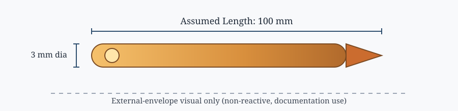
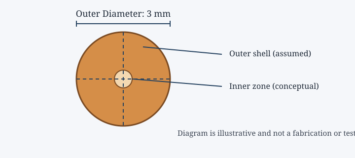

# FissionWatch

Detect and monitor software chain reactions in enterprise dependency graphs.

## Research Extension: Matchstick Rocket Digital Twin

This repository also contains a **video-to-physics digital-twin case study** documenting the reconstruction and analysis of a matchstick-based experimental object from video frames. The material is organized as an educational engineering workflow:

> **Observe → Reconstruct → Model → Analyze → Compare → Document limitations**

The case study brings together:

- Video-frame observations and scale calibration
- CAD-style geometry reconstruction
- Cross-sectional conceptual modeling
- Internal/external flow-analysis concepts
- Thermal and structural-analysis visualizations
- Motion tracking and trajectory comparison
- Simulation-versus-observation validation discipline

### Important scientific status

The posters and prior visualizations contain a mixture of measured dimensions, assumptions, illustrative CFD fields, and estimated performance values. Unless accompanied by solver files, boundary conditions, mesh information, calibration records, and raw measurements, numerical results must be treated as **illustrative estimates—not experimentally validated findings**.

The repository does not provide instructions for constructing, sealing, pressurizing, optimizing, or testing a hazardous propulsion device. It focuses on safe documentation, model verification, uncertainty, and educational analysis.

## Documentation

- [Case-study overview](docs/matchstick-rocket/00-overview.md)
- [Video and geometry reconstruction](docs/matchstick-rocket/01-video-and-geometry.md)
- [Physics and modeling framework](docs/matchstick-rocket/02-physics-framework.md)
- [CFD, thermal, and structural interpretation](docs/matchstick-rocket/03-analysis-interpretation.md)
- [Validation and limitations](docs/matchstick-rocket/04-validation-and-limitations.md)
- [Evidence classification](docs/matchstick-rocket/05-evidence-register.md)

## Rocket visuals

## Repository scope

The original FissionWatch software-reliability research remains the primary software project. The matchstick-rocket materials are maintained as a separate research case study under `docs/matchstick-rocket/`.
